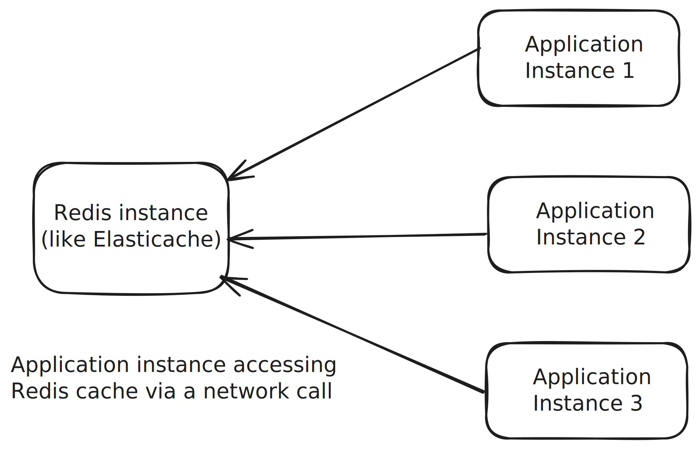
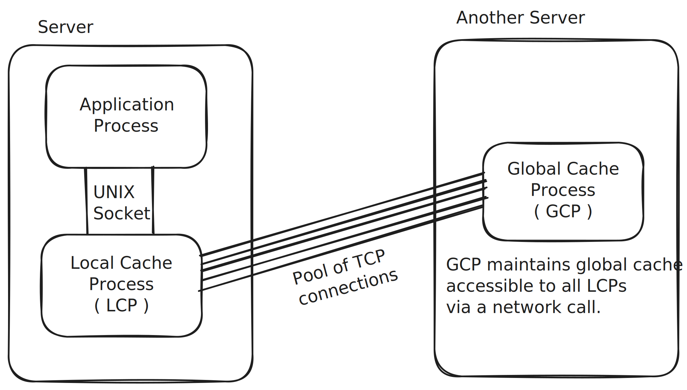
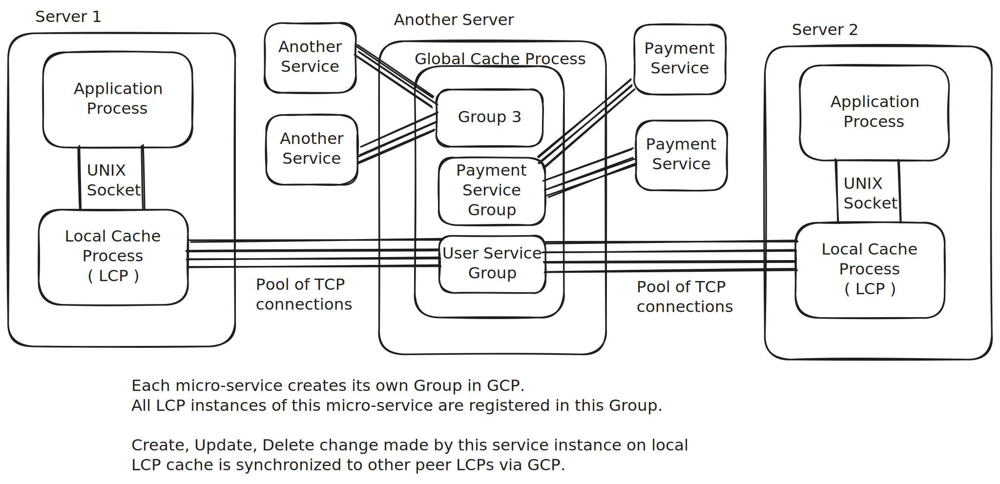

# DECI – Distributed Eventually Consistent In-Memory Cache

**Ultra-fast, local cache with eventual consistency for microservices.**

---

## Why DECI?

Traditional microservice architectures often use a separate cache service (like ElastiCache), making every microservice instance perform network calls for cache operations. These network calls increase latency and undermine the key benefit of an in-memory cache.

**DECI** (Distributed Eventually Consistent In-Memory Cache) takes a new approach: it keeps the cache alongside the application process, truly harnessing the speed and efficiency of local memory.

---

## How DECI Works

For each microservice instance, a dedicated **LCP** (Local Cache Process) runs on the same server. Applications communicate with the LCP via a UNIX socket, ensuring that cache access is always local and blazing fast.

---

## Overview Diagram

---

## Distributed Synchronization and Global Cache

DECI introduces another component, **GCP** (Global Cache Process), running on a separate server. The GCP maintains a global cache accessible by all LCPs. When the application modifies the local cache, LCP forwards the change to GCP, which then synchronizes these changes across all peer LCPs for that microservice—making the cache eventually consistent everywhere.

---

## Synchronization in Microservices

Each micro-service creates its own group in GCP. All LCP instances of that micro-service join the group. Any create, update, or delete operation made in the LCP’s local cache is propagated via GCP to all the other LCPs in the group, ensuring all instances are eventually consistent.

---

### Key Advantages

- **Low Latency:** Cache operations happen in-memory, on the local server.
- **Scalable:** Every application instance and LCP is independent, enabling horizontal scaling.
- **Eventual Consistency:** GCP ensures all peers see updated data after local changes.
- **Minimal Network Overhead:** Only synchronization and global cache queries use the network—cache hits are purely local.

---

## Project Status

Alpha – actively developed and being polished for external adoption.

---

## Contributing

Contributions, issues and feature requests are welcome! Please open an issue to discuss your proposal.

---

## License

MIT

---
